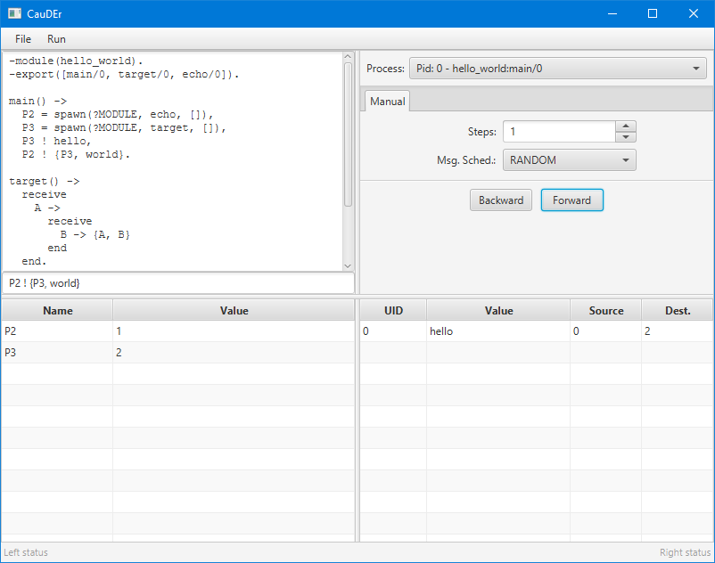

# CauDEr UI

A prototype of a UI for [CauDEr v2](https://github.com/mistupv/cauder-v2) written in Kotlin using TornadoFX 2 (JavaFX).

The purpose of this prototype is to test the communication between Kotlin and Erlang using Jinterface, and also test the
feasibility of replacing the current UI, built using wxErlang, with a new one using JavaFX, as such very little
functionality is implemented, only the following basic operations are available:

- Open file
- Start system
- Forward and backward manual step

You may also find bugs or experience crashes.

## Development

### Prerequisites

- JDK 15 or higher
- Erlang 23 or higher (for CauDEr)
- CauDEr v2

### Building

To build the project, type:

	./gradlew build

To build a custom runtime image for your platform, type:

	./gradlew runtime

You can also create a zipped version of that image for distribution:

	./gradlew runtimeZip

To build an installable image for your platform, type:

    ./gradlew jpackage

### Running

Download the latest version of branch `dev` from `mistupv/cauder-v2` and compile it:

    git clone -b dev https://github.com/mistupv/cauder-v2.git
    cd cauder-v2
    make compile

Then run the project as a stand-alone application:

    ./gradlew run --args="--dbg <cauder-path>/_build/default/lib/cauder/ebin"

or if you build a custom image:

    cd build/image/bin
    ./gradlew --dbg <cauder-path>/_build/default/lib/cauder/ebin

Where `<cauder-path>` is the folder where you cloned the CauDEr v2 repository.

## License

View [LICENSE](LICENSE) file
